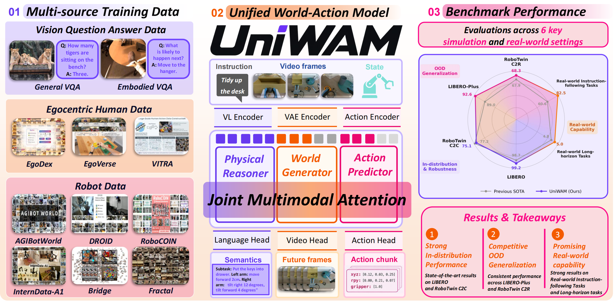

# UniWAM: Unified World-Action Model

<p align="center">
  <a href="https://arxiv.org/abs/2610.02054"></a>
  <a href="https://uniwam.github.io"></a>
  <a href="https://www.modelscope.cn/collections/Kosmos524/UniWAM"></a>
</p>


## 📃 Overview

<p align="center">
  <a href="uniwam_teaser.pdf">
    
  </a>
</p>

UniWAM brings semantic understanding, visual prediction, and action generation into one MoT architecture. Its three experts exchange information through joint multimodal attention. During pretraining, physical-language supervision and complementary signals from robot, human egocentric, and VQA data build embodied knowledge. During post-training, future visual noise augmentation reduces reliance on precise future predictions, while encoded action history initializes action generation through flow matching.


## 🌟 Key Features

- **Unified world-action architecture:** A Mixture-of-Transformers (MoT) connects a physical reasoner, a world generator, and an action predictor through joint multimodal attention.
- **Physical-language grounding:** Robot actions are represented in natural language, adapting the vision-language component to embodied tasks while retaining its language capabilities.
- **Complementary multimodal supervision:** The pretraining recipe combines robot demonstrations, human egocentric data, and visual question answering (VQA) data to train the appropriate experts.
- **Efficient action generation:** Future visual noise augmentation and history-conditioned flow matching support action generation with fewer denoising steps.


## 📚 Contents

- `models/`, `train/`, `utils/`, `bak/wan/`: physical language model and training runtime.
- `data/robotwin2/`: RoboTwin loader and conversion utilities (code only).
- `data/libero/`, `examples/libero_plus/`, `scripts/libero/`: LIBERO training and LIBERO/LIBERO-plus evaluation code.
- `configs/`: RoboTwin physical language, IDM, history-flow, and future-noise examples.
- `inference/robotwin/uniwam/`: self-contained RoboTwin policy deployment.

Bridge, DROID, Fractal, and real-world inference are intentionally out
of scope for this release.

## 🚀 Installation

Python 3.10 and a CUDA-capable PyTorch installation are recommended. Install
PyTorch for your CUDA version first, then install the remaining dependencies:

```bash
conda create -n ola-sem python=3.10 -y
conda activate ola-sem
pip install torch==2.7.1 torchvision==0.22.1 --index-url https://download.pytorch.org/whl/cu128
pip install flash-attn --no-build-isolation
pip install -r requirements.txt
```

## 💾 Model weights

### Pretrained assets for training

Standard training uses the following pretrained assets:

| Pretrained asset | Link | Fine-tuning data or role |
| --- | --- | --- |
| ` UniWAM-base` | [ModelScope](https://www.modelscope.cn/collections/Kosmos524/UniWAM) | pretained on mixed robot,human and VQA datasets. |
| ` UniWAM-robotwin-clean` | [ModelScope](https://www.modelscope.cn/collections/Kosmos524/UniWAM) |post-trained on the clean subset of RoboTwin 2.0. |
| `Wan-AI/Wan2.2-TI2V-5B` | [Hugging Face](https://huggingface.co/Wan-AI/Wan2.2-TI2V-5B) | Video backbone, VAE.|
| `Qwen/Qwen3-VL-2B-Instruct` | [Hugging Face](https://huggingface.co/Qwen/Qwen3-VL-2B-Instruct) | Vision-language backbone;. |

Keep the downloaded directory structure as follows so that it matches the
default paths in the training configs:

```text
pretrained_models/
├── UniWAM-base/
├── Qwen3-VL-2B-Instruct/
└── Wan2.2-TI2V-5B/
    └── Wan2.2_VAE.pth
```


## 🚀 Post-training

### RoboTwin

See the [RoboTwin post-training guide](docs/robotwin/README.md)
for data preparation, training, and inference.

### LIBERO

See the [LIBERO guide](docs/libero/README.md) for original LIBERO training and
separate original LIBERO / LIBERO-plus evaluation. 

## ❤️ Acknowledgements

This repository is based on and modified from
[Motus](https://github.com/thu-ml/Motus). We sincerely thank the Motus authors
for their valuable open-source work and contribution to the community.

## 🖊 Citation


```bibtex
@article{chen2026uniwam,
  title = {UniWAM: Unified World-Action Model},
  author={Chen, Jiayi and Song, Wenxuan and Wang, Jingbo and Zhou, Shuai and Gong, Xicheng and Fan, Zehua and Zhou, Ziyang and E, Junwu and Yan, Haodong and Li, Fuhao and Yu, Qize and Huang, Xu and Wang, Pengwei and Chen, Wen and Zhou, Shunbo and Li, Haoang},
  journal={arXiv preprint arXiv:2610.02054},
  year={2026}
}
```
